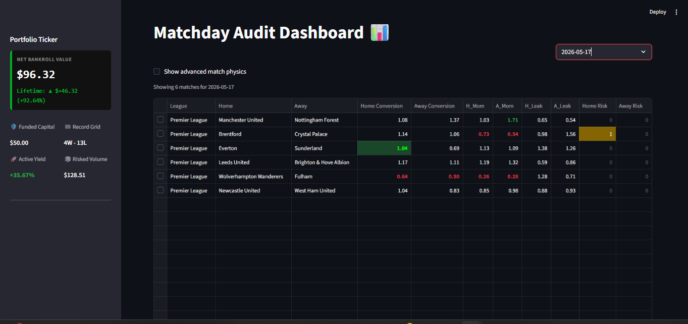
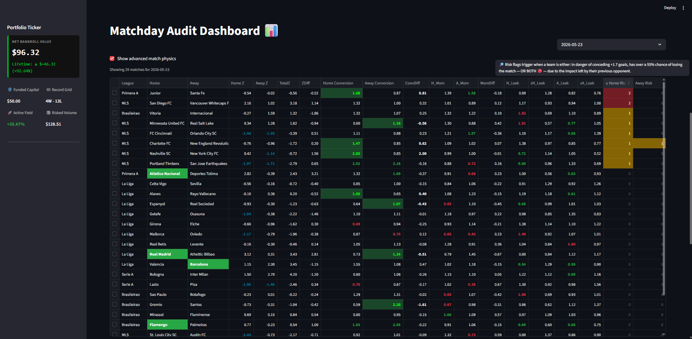
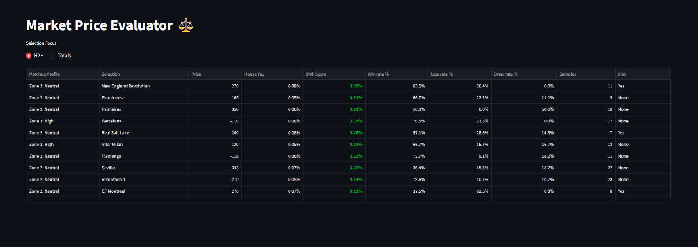
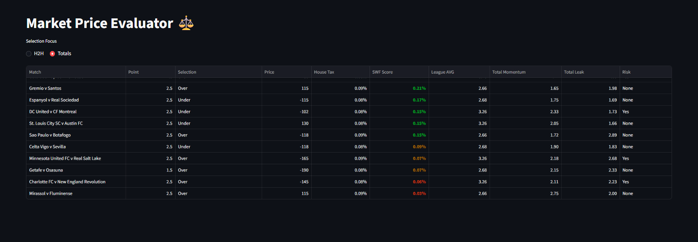

# SWF Analytics

> A soccer match analytics engine that models attack pressure, conversion efficiency, momentum, and defensive fragility — then compares statistical probability against bookmaker market pricing to surface high-value selections via the identification of mispriced assets.



---

## What This Is

SWF is a personal analytics system built from scratch to answer one question: **are bookmaker odds ineffeciently priced relative to what the statistics actually say?**

It is not a betting bot. It is not a prediction system. It is a **market evaluation engine** — it quantifies team performance across multiple dimensions, models expected match outcomes using those metrics, and produces a score (the **SWF Score**) that measures the gap between statistical probability and market-implied probability. Standard sportsbooks price totals and moneylines based heavily on public narrative, rolling box scores, and localized team trends. This system exploits those blind spots through its metric framework.


A positive SWF Score means the market is underpricing the statistical case for a given outcome. That's the signal. That's the mispriced asset.

---

## Stack

| Layer | Technology |
|---|---|
| Database | MySQL 8 |
| Analytics | SQL (CTEs, views, window functions) |
| Application | Python 3, Streamlit |
| Visualization | Plotly, Streamlit native components |
| Probability Model | Poisson distribution (inline SQL) |

---

## Database Schema

The system is built on a normalized relational schema:

```
competitions → matches → match_stats
                      → match_events
teams        → match_stats
matches      → processed_odds → portfolio_tickets → portfolio_selections
```

**Core tables:**

- `competitions` — league registry with support for seasonal phases where required. (apertura/clausura)
- `teams` — team registry.
- `matches` — match records with venue, round, season, and segment flags where required and for future international tournament expansion. (handles two-legged ties)
- `match_stats` — per-team per-match stats split by half: goals, shots, SOT, corners, possession, cards, penalties, own goals committed, own goals benefitted.
- `match_events` — event log (red cards, etc.) used as data quality guardrails.
- `processed_odds` — normalized bookmaker odds with implied probability and house edge (vig) removed.
- `portfolio_tickets / portfolio_selections` — bankroll tracking and selection history.

**Computed columns (MySQL `GENERATED ALWAYS AS`):**
`totalgoals`, `totalshots`, `totalSOT`, `totalcorners` are auto-derived from half-time splits. `net_profit` is auto-derived from stake, odds, and settled status.

**Data integrity:**
- Unique constraint on `(competition_id, season, round, home_team_id, away_team_id)` prevents duplicate match entries.
- Unique constraint on `(match_id, team_id)` in `match_stats` prevents duplicate team rows per match.
- All division operations use `NULLIF(..., 0)` to prevent zero-division errors throughout.

**Current dataset:** 3,000+ matches across 10 domestic leagues.

---

## Metric Framework

Metrics are derived through a layered view architecture. No raw stats are consumed directly by the dashboard — everything passes through a chain of views that progressively build complexity.

### Layer 0 — Identity Baseline (`v_team_home_away_identity`)
Season-long home/away split averages per team. Requires minimum 5 matches to qualify. Covers: shots, SOT, corners, possession, goals scored, goals conceded, shots allowed, SOT allowed.

### Layer 1 — Recent Form (`v_team_recent_form`)
Rolling last-5-match window per team per competition per season. Red card matches are excluded as contaminated samples (a team playing 60 minutes with 10 men is not representative of their true performance profile).

### Layer 2 — Hybrid Metrics (`v_team_hybrid_metrics`)
Blended metric combining identity AND recent form:

```
Hybrid = (0.70 × Season Identity) + (0.30 × Recent Form)
```

This weighting prioritizes statistical stability while keeping the model sensitive to current team trajectory.

### Layer 3 — Match Pressure Profile (`v2_match_pressure_profile`)
Models the **interaction** between each team's attack and the opponent's defense:

```
Attack Pressure = (0.60 × shots) + (0.25 × corners) + (0.15 × SOT)
Possession Modifier = 1 + ((possession% - 50) / 200)

HPressure_vs_ADef = (Home Attack Pressure × Possession Modifier)
                    / ((Away Defensive Suppression × 0.70) + (Away Defensive Resistance × 0.30))
```

Results are z-scored against the league's own seasonal baseline (so a pressure reading means something different in the Premier League vs. Liga MX, and the model accounts for that).

Stress zones (Low / Neutral / High / Redline) classify each team's pressure exposure relative to their league's average.

### Layer 4 — League Baselines (`v_league_baselines`)
Per-league, per-season calibration metrics:
- `AVG_Goals`, `StdDev_Goals` — scoring environment
- `AbsoluteConv` — league-wide goals/SOT ratio (how hard it is to score here)
- `ConvBaseline` — relative conversion health (attack efficiency vs. defensive fragility)
- `Chaos_Index` — coefficient of variation for goals; measures league unpredictability (higher index, higher instability)
- `AVG_MatchPressure`, mean/stddev for H/A pressure (z-score anchors)

### Layer 5 — Matchday Audit Report (`v4_matchday_audit_report`)
Per-match composite report combining all layers:

| Signal | What it measures |
|---|---|
| `hZ / aZ` | Z-scored attack atmosphere (measures whether a team is physically projected to attack at high intensity or play constricted at a low volume) |
| `hconv / aconv` | Finishing efficiency (hybrid goals / hybrid SOT) vs opponent defensive fragility (hybrid goals conceded / hybrid SOT allowed) |
| `H_Mom / A_Mom` | Recent conversion rate vs. season-long identity (momentum ratio) |
| `H_Leak / A_Leak` | Recent defensive fragility vs. season-long identity |
| `zH_Leak / zA_Leak` | Team's defensive identity vs. the league's venue-specific (home or away) baseline identity |
| `H_Risk / A_Risk` | Hangover risk flag — models post-opponent fatigue/psychological effect |
| `form_diff` | 5-match points differential |

### Layer 6 — Market Evaluator (SWF Score)

**H2H market:**
```
SWF Score = (Team Win Rate in Stress Zone / 100) − Market Fair Probability
```
Win rates are drawn from `team_stress_index`, which tracks historical performance per team per stress zone with a minimum 6-sample threshold before a selection qualifies.

**Totals market (Poisson model):**
```
λ = League AVG Goals × (1 + TotalZ/10) × (Avg Team Conv / League ConvBaseline)

P(Under 2.5) = e^(-λ) × (1 + λ + λ²/2)
P(Over 2.5)  = 1 − P(Under 2.5)

SWF Score = Model Probability − Market Fair Probability
```

A positive SWF Score in either market means the statistical case is stronger than what the market is pricing. Only positive scores surface in the dashboard.

---

## Dashboard

The Streamlit app has two panels:

**Matchday Audit Dashboard** — date-selectable match grid showing all tracked leagues for that day. Color-coded metrics: green for strong signals, red for weak or leaking. Toggle for simplified vs. advanced physics view. Row-click opens a deep dive popover with forensic match profile. Zone specialist highlighting triggers when a team has ≥70% win rate in their current stress zone with ≥8 qualifying matches.


**Market Price Evaluator** — filters to H2H or Totals market. Surfaces only selections where SWF Score > 0 and minimum sample thresholds are met. Color-coded by score tier: green (≥0.12), orange (0.06–0.12), red (<0.06).



The sidebar tracks live bankroll metrics: net value, lifetime ROI, active yield, W/L record, and volume risked.

---

## Project Status

This is an active personal research project. The core metric framework and dashboard are stable. Current development focus is on enhanced data visualization and expanding markets along with league coverage.

**What's working:** Full pipeline from raw data → metrics → dashboard → odds comparison → bankroll tracking

**What's in progress:** GitHub CI, historical backtesting view, cross-market price comprison

---

## Setup

> This project runs locally against a MySQL instance. No hosted demo is available at this time.

```bash
# Clone the repo
git clone https://github.com/silversurfer444/swf-analytics.git
cd swf-analytics

# Install dependencies
pip install -r requirements.txt

# Configure your database connection in app.py
# Replace credentials in get_db_connection()

# Run the app
streamlit run app.py
```

**Requirements:** Python 3.10+, MySQL 8.0+, Streamlit, pandas, plotly, mysql-connector-python

---

## Notes on Data

Match data is manually curated and entered. The pipeline is designed for accuracy over volume — every match in the database has been reviewed before entry. This is intentional: the model's integrity depends on clean inputs.

Odds data is sourced externally and normalized through the `processed_odds` pipeline before reaching the dashboard.

---

*Built independently. No degree. No bootcamp. Just the problem and the tools.*
